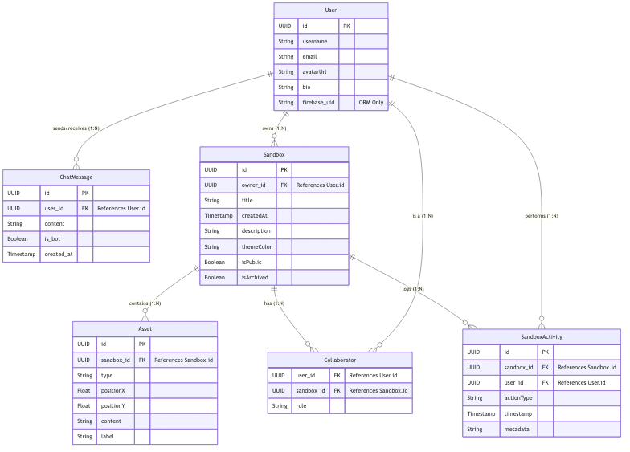

# PostgreSQL Database Schema Design

The Ostrich application uses **Google Cloud SQL (PostgreSQL)** as its primary relational database. However, the database is managed declaratively through **Firebase Data Connect**, which translates a GraphQL schema into underlying SQL tables, constraints, and indexes. 

## Architectural Overview
By leveraging Data Connect:
1. **Type Safety**: Frontend clients and backend services use strongly-typed generated SDKs instead of raw SQL queries.
2. **Schema Management**: Database migrations are fully automated based on the `dataconnect/schema/schema.gql` definition.
3. **Security**: Row-level access control and authorization are enforced at the Data Connect edge layer before the queries ever hit the database.

## Entity Relationship Diagram (ERD)

The following diagram visualizes the relationships, foreign keys, and fields of our core entities.

## Table Specifications

### 1. `User`
The central identity of the system. While the GraphQL API utilizes it for relations, the Backend ORM synchronizes it directly with Firebase Authentication.
- `id` (UUID): Primary Key.
- `firebase_uid` (String): Indexed reference back to Firebase Auth.
- `username`, `email` (String): Uniquely identifies the user.
- **Access Pattern**: Queried upon initial login/websocket connection by the `ostrich-controlplane` to resolve the user's internal ID.

### 2. `ChatMessage` (Backend ORM)
Manages the persistent chat history between the User and the Sandbox Agent.
- `id` (UUID): Primary Key.
- `user_id` (UUID): Foreign key linking to the `User`.
- `content` (Text): The raw text/markdown payload of the message.
- `is_bot` (Boolean): A flag differentiating human messages from agent responses.
- `created_at` (Timestamp): Used to chronologically order the chat stream.
- **Access Pattern**: The `ostrich-controlplane` performs an `INSERT` on this table the moment a WebSocket frame is received, or a PubSub message arrives from the Sandbox. It is heavily queried when a user reconnects to load their previous conversation history.

### 3. `Sandbox`
Represents an overarching conversational canvas or workspace.
- `id` (UUID): Primary Key.
- `owner_id` (UUID): Foreign key linking back to the `User` who created the Sandbox. Deleting a user cascades to delete their sandboxes.
- `createdAt` (Timestamp): Tracks the instantiation time.
- **Access Pattern**: Frequently queried by the dashboard to list active/archived workspaces.

### 3. `Asset`
Represents a specific sub-component, UI element, or data artifact placed inside a Sandbox.
- `sandbox_id` (UUID): Foreign key binding the asset to its parent Sandbox.
- `positionX`, `positionY` (Float): Spatial coordinates for rendering the asset on an infinite 2D canvas.
- `type` (String): Categorical enum (e.g., `text_note`, `code_snippet`, `image`).
- `content` (String): The raw payload (JSON, markdown, or text).
- **Access Pattern**: Fetched recursively alongside Sandbox metadata when a user opens a workspace.

### 4. `Collaborator` (Join Table)
Enables multi-user collaboration in a single Sandbox.
- **Composite Primary Key**: `[user_id, sandbox_id]`
- `role` (String): Specifies permission boundaries (`viewer`, `editor`, `admin`).
- **Access Pattern**: Data Connect authorization policies use this table to verify if the requesting `auth.uid` is allowed to mutate Sandbox assets.

### 5. `SandboxActivity`
An immutable append-only event log used for audit trails and potentially event-sourcing the canvas state.
- `sandbox_id`, `user_id` (UUID): The context and actor.
- `actionType` (String): The event that occurred (`ASSET_MOVED`, `MESSAGE_SENT`, `AGENT_INVOKED`).
- `metadata` (String): A stringified JSON payload holding contextual data (e.g., coordinates moved from/to).
- **Access Pattern**: Queried for "undo/redo" operations or displaying an activity feed to Collaborators.

## Indexing Strategy
To ensure low-latency reads, Data Connect automatically generates standard B-Tree indexes on all Foreign Keys (e.g., `sandbox_id` on the `Asset` table, and `owner_id` on the `Sandbox` table). Because workspaces load all assets concurrently, the `Asset.sandbox_id` index is highly utilized and kept resident in memory.
