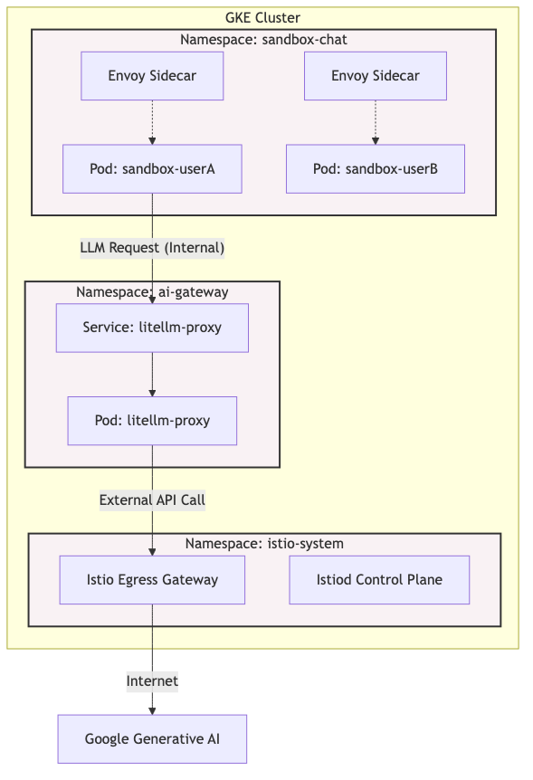
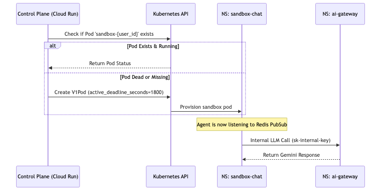

# Kubernetes Architecture & Namespace Design

The core of the Ostrich agent engine runs on **Google Kubernetes Engine (GKE) Autopilot**. GKE Autopilot abstracts away node management, allowing us to focus entirely on pod topology, namespaces, and security policies.

## Namespace Topology

To ensure strict multi-tenancy, security boundaries, and organized resource allocation, the cluster is divided into distinct Kubernetes Namespaces.

## Detailed Namespace Breakdown

### 1. `sandbox-chat`
This is the primary execution arena for user sandboxes. 
- **Workloads**: Thousands of ephemeral pods (`sandbox-{user_id}`) running the LangGraph-based agent harness.
- **Lifecycle**: Pods are dynamically provisioned by the `ostrich-controlplane`. They have an `active_deadline_seconds` limit (TTL), ensuring they are automatically reaped by the Kubernetes garbage collector after 30 minutes of inactivity.
- **Workload Identity**: Pods in this namespace mount the `sandbox-agent-sa` Kubernetes Service Account (KSA). This KSA is cryptographically mapped to a Google Cloud IAM Service Account, granting the sandboxes exact permissions to write to the `ostrich-agent-workspaces` Cloud Storage bucket without hardcoded JSON keys.
- **Security Posture**: Highly restricted. The Istio Envoy sidecars block all raw internet egress to prevent the agents from downloading malicious payloads or exfiltrating data.

### 2. `ai-gateway`
This namespace isolates the shared LLM infrastructure from the tenant sandboxes.
- **Workloads**: A deployment of the [LiteLLM Proxy Server](https://docs.litellm.ai/docs/proxy/quick_start).
- **Function**: Acts as a Zero-Trust internal gateway. Sandboxes are not given actual Gemini API keys; they are given a dummy internal token (`sk-internal-proxy-key`). The sandbox routes its requests to `litellm-proxy.ai-gateway.svc.cluster.local`, which authenticates the internal token, attaches the *real* high-privilege Gemini API key, and forwards the request to Google's API.
- **Benefits**: Centralized rate limiting, cost tracking per user, and an air-gapped secret architecture.

### 3. `istio-system`
The system-level namespace managing the service mesh.
- **Workloads**: `istiod` (Control Plane) and the Egress/Ingress Gateways.
- **Function**: Injects Envoy proxy sidecars into the `sandbox-chat` pods. It enforces the `sandbox-network-policy.yaml`, ensuring that the only way for a sandbox to communicate with the outside world is via approved egress gateways (e.g., to reach Cloud Storage or the internal AI Gateway).

## Pod Interactions & Orchestration

When a user connects via WebSocket, the Control Plane (running externally on Cloud Run) uses the Kubernetes API to orchestrate a pod in `sandbox-chat`. 

