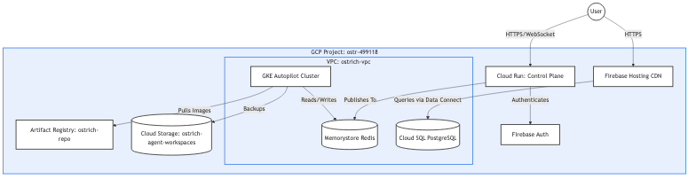

# Complete GCP Infrastructure Setup

The Ostrich architecture relies heavily on Google Cloud Platform's managed services to scale securely. The infrastructure is deployed entirely as code via Terraform (`infrastructure/gcp/main.tf`).

## High-Level Architecture Diagram

## Component Breakdown

### 1. Cloud Run (The Control Plane)
- **Service**: `ostrich-controlplane`
- **Role**: The centralized traffic ingestor. It serves the REST API and handles the persistent WebSocket connections (`/ws/chat`) from the React frontend.
- **Why Cloud Run?**: It auto-scales to zero and can effortlessly handle thousands of concurrent WebSocket connections. It abstracts away server management while securely residing behind Google's edge network.

### 2. GKE Autopilot (The Sandbox Arena)
- **Service**: `ostrich-cluster`
- **Role**: Houses the multi-tenant agent execution environments (Sandboxes) and the internal LLM Gateway.
- **Why Autopilot?**: Instead of manually provisioning node pools, Autopilot scales the underlying compute automatically based on the requested Pod resources (e.g., `requests: cpu=250m`). You only pay for the exact CPU/Memory the sandboxes consume while they are active.

### 3. Memorystore for Redis (The Nervous System)
- **Service**: `ostrich-redis` (Basic Tier, 1GB)
- **Role**: A lightning-fast, in-memory message broker.
- **Flow**: The Control Plane and the Sandbox Pods never communicate directly. They use Redis Pub/Sub channels (e.g., `channel:sandbox:{user_id}`). This decoupling ensures that if a control plane instance crashes, the sandbox can still process the LLM request, and the user can reconnect to a different Cloud Run instance without losing the message stream.

### 4. Cloud SQL & Firebase Data Connect (The Persistence Layer)
- **Service**: `ostrich-sql` (PostgreSQL)
- **Role**: The permanent system of record for Users, Workspaces, and Chat histories. 
- **Data Connect**: Instead of the backend querying SQL directly, the frontend and control plane use Firebase Data Connect's generated SDKs. Data Connect acts as a serverless GraphQL middleware sitting directly in front of Cloud SQL, enforcing Row-Level Security rules instantly.

### 5. Private Services Access (VPC Peering)
- **Role**: Both Cloud SQL and Memorystore Redis are provisioned deep inside the Google network without public IP addresses. 
- **Implementation**: We allocate a private IP block (`ostrich-redis-peering-alloc`) inside the `ostrich-vpc` and peer it directly with the Google Services VPC. This ensures that Cloud Run (via Serverless VPC Access) and GKE can route to the databases purely over internal IPs, making the databases invisible to the public internet.

### 6. Artifact Registry
- **Service**: `ostrich-repo`
- **Role**: The private Docker image repository. GKE pulls the `ostrich-sandbox:latest` image directly from here over Google's internal backbone, ensuring lightning-fast pod startup times.

### 7. Cloud Storage (Workspaces)
- **Service**: `ostrich-agent-workspaces`
- **Role**: Object storage bucket. Because GKE pods are ephemeral and deleted after 30 minutes, the agent uses a tool to zip the local `/workspace` directory and upload it to GCS. When a pod is recreated, it re-downloads the archive to restore state. Access is strictly granted via Workload Identity.
