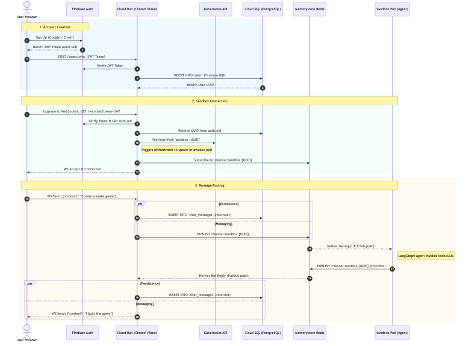

# User Data Flow: From Creation to Message Exchange

This document maps the journey of a user from account creation to real-time interaction with the AI Sandbox agent.

## User Lifecycle Flow

## Flow Mechanics

### 1. Account Creation & Synchronization
Firebase Auth manages the actual credentials and OAuth handshakes. However, because our relational logic lives in PostgreSQL, we perform a "sync" step. When a user logs in for the first time, the frontend passes the Firebase Identity JWT to the Control Plane. The Control Plane verifies the JWT using the Firebase Admin SDK and inserts a mirrored record into PostgreSQL, returning an internal `UUID`. All subsequent database associations (Sandboxes, Activity, Assets) are bound to this internal PostgreSQL UUID, not the string-based Firebase UID.

### 2. Connection Upgrade
The architecture strictly avoids putting heavy LLM execution logic into the API server. When a user requests a WebSocket connection (`/ws/chat`), the Control Plane authenticates the token and accepts the upgrade. Immediately after, it makes an async call to the Kubernetes API to verify if the user's dedicated Sandbox Pod is running. If the user was offline and their pod was garbage collected, the Control Plane instructs K8s to spin up a new instance. 

### 3. Pub/Sub Message Exchange
The Control Plane acts exclusively as a dumb router. 
When the user sends a message, the Control Plane simply wraps it in JSON and `PUBLISH`es it to a Redis channel named `channel:sandbox:{user_id}`. It then immediately yields execution.

Deep within the GKE cluster, the Sandbox Pod is sitting in a `while True` loop, subscribed to that exact Redis channel. When Redis pushes the message over the socket, the Sandbox wakes up, adds the message to its LangGraph state, and processes it. Once the agent formulates a reply (which may take several seconds), the Sandbox pushes the response back into the identical Redis channel. The Control Plane intercepts this, saves it to PostgreSQL for chat history retention, and pushes the payload down the WebSocket to the browser.
