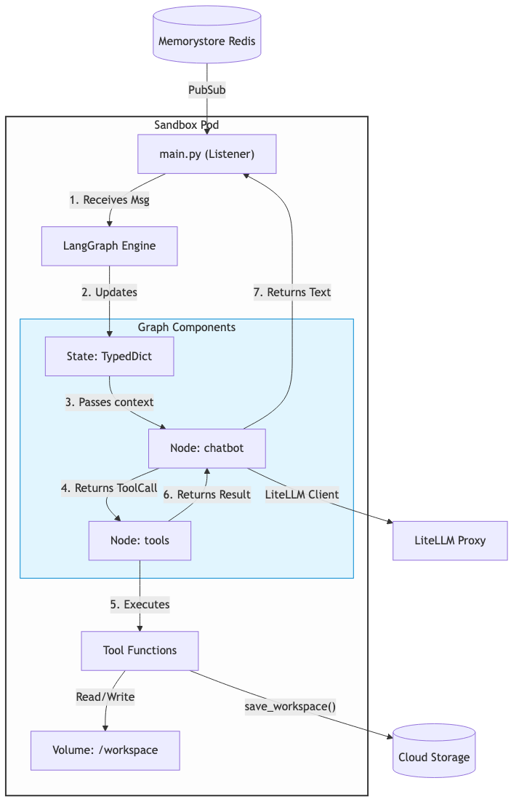

# Sandbox Operations & Agent Internals

The Sandbox is the beating heart of the Ostrich engine. It is a highly ephemeral, isolated Kubernetes Pod (`sandbox-{user_id}`) running a sophisticated ReAct (Reason + Act) agent powered by LangGraph.

## Internal Architecture

## LangGraph & LiteLLM Integration

The intelligence of the agent is modeled as a Directed Cyclic Graph using **LangGraph**.
1. **The Graph**: The graph has two primary nodes: `chatbot` (the LLM) and `tools` (the execution environment). 
2. **Conditional Routing**: When a user message arrives, the graph invokes the `chatbot` node. If the LLM determines it needs to read a file or run a bash command, it generates a `tool_call`. LangGraph intercepts this, routes the execution to the `tools` node, runs the python function securely within the pod, appends the tool output to the conversational `State`, and routes *back* to the `chatbot` node. This cycle repeats until the agent generates a final text response, at which point the graph exits and the response is pushed to Redis.
3. **LiteLLM**: To remain model-agnostic, LangGraph binds to `ChatLiteLLM`. Rather than directly authenticating with Google Generative AI, `ChatLiteLLM` is configured with `api_base="http://litellm-proxy.ai-gateway..."`. This ensures the sandbox never possesses a real API key.

## Ephemerality & The TTL Lifecycle

Sandboxes are fundamentally untrusted and resource-heavy. They cannot run forever.
- **TTL Constraint**: Every sandbox pod is created with an `active_deadline_seconds=1800` parameter. Exactly 30 minutes after instantiation, Kubernetes forcefully kills the pod and wipes its local memory.
- **Lazy Re-creation**: If a user comes back an hour later and sends a message, the WebSocket Control Plane queries the Kubernetes API. Finding the pod dead, it simply creates a new one. The new pod boots up, subscribes to the user's Redis channel, and resumes listening.

## State Management & Backups

Because the pod is deleted every 30 minutes, the `/workspace` directory (where the agent writes code) is ephemeral.
- **The `save_workspace` Tool**: To preserve work, the agent is equipped with a `save_workspace` tool. Before the user leaves, or periodically, the agent can call this tool. The tool uses Python's `shutil.make_archive` to zip the entire `/workspace` directory and uses the Google Cloud Storage SDK to upload it to `ostrich-agent-workspaces/sandbox_{user_id}.zip`.
- **Workload Identity Security**: The pod does not have a hardcoded JSON key to upload to GCS. It uses Google Kubernetes Engine's **Workload Identity**. The pod's Kubernetes Service Account (`sandbox-agent-sa`) intercepts metadata API calls and exchanges them for short-lived OAuth tokens, allowing password-less authentication to the Storage bucket.
