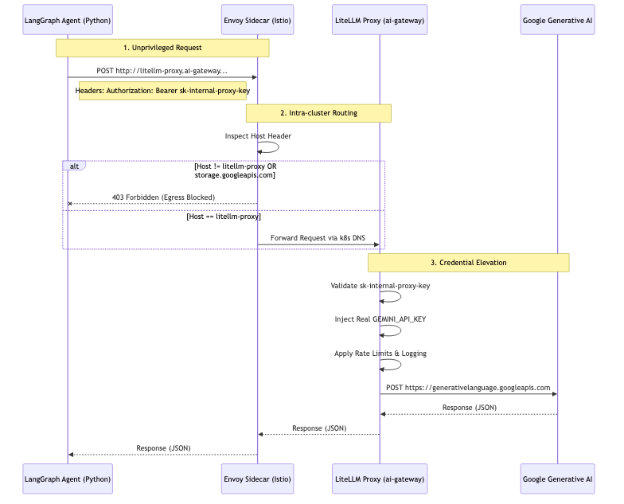

# Zero-Trust AI Gateway Integration

The combination of the Sandbox Agent, Envoy Proxy, and LiteLLM Gateway forms a robust Zero-Trust AI architecture. This ensures that the tenant sandboxes can invoke state-of-the-art models like Google Gemini without ever possessing sensitive credentials.

## Architectural Flow

## Security & Observability Benefits

### 1. Air-Gapped Credentials
If an attacker successfully breaches the sandbox through a Remote Code Execution (RCE) vulnerability and gains root shell access, they can dump all environment variables. Because the agent only has `sk-internal-proxy-key`, the attacker cannot steal the highly-billed `GEMINI_API_KEY`. The real key is stored exclusively as a Kubernetes Secret mounted only to the `ai-gateway` namespace, which is completely inaccessible to the `sandbox-chat` pods.

### 2. Guardrails & Content Filtering
Because all LLM traffic funnels through a centralized LiteLLM proxy, the engineering team can implement fleet-wide guardrails. For example, PII redaction, prompt injection filtering, or model routing (e.g., fallback from Gemini 1.5 Pro to Gemini 1.5 Flash during outages) can be done entirely at the Gateway layer without modifying or redeploying the sandbox code.

### 3. Rate Limiting via Envoy & LiteLLM
- **Envoy**: Protects the internal cluster from noisy neighbors by applying connection limits, preventing a runaway `while True` loop in a sandbox from DDoS-ing the internal LLM gateway.
- **LiteLLM**: Enforces token-based rate limits and quota budgets per `USER_ID`. If a user exhausts their daily quota, LiteLLM intercepts the request and returns a `429 Too Many Requests` error, which LangGraph gracefully catches and forwards to the frontend.
