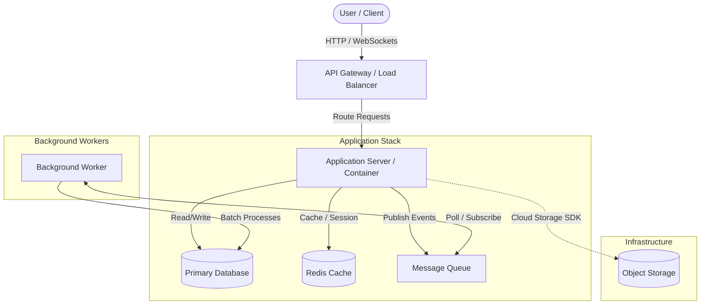

# Ostrich - High-Level System Design

This directory contains the system architecture designs, data flows, and architectural decision records (ADRs) for the Ostrich project.

## System Architecture

## Core Components

1. **API Gateway / Load Balancer**: Handles SSL termination, routing, rate limiting, and serves static assets.
2. **Application Server (package/)**: The main Python application container, handling business logic, user authentication, and API endpoints.
3. **Background Workers**: Asynchronous task processors for resource-intensive operations (e.g., PDF generation, mailers, long-running calculations).
4. **Primary Database**: Relational storage (e.g., PostgreSQL) for structured user data.
5. **Cache/Session Store**: High-performance in-memory store (e.g., Redis) for quick lookups and caching.
6. **Object Storage**: Cloud storage (AWS S3 or GCP Cloud Storage) for unstructured uploads.

## Data Flow

### 1. Request-Response Flow (Synchronous)
- Client sends a request to the API Gateway.
- API Gateway routes the request to the nearest healthy application node.
- The Application Server authenticates the request, fetches/updates data from the database, and returns the response.

### 2. Async Task Flow (Asynchronous)
- Application Server receives a request that requires slow processing.
- Application Server pushes a task definition to the Message Queue and immediately returns a job ID to the Client.
- The Worker service picks up the task, processes it, updates the Database with the status/result, and optionally notifies the client.

## Technology Decisions

| Dimension | Option A | Option B | Selected | Rationale |
| :--- | :--- | :--- | :--- | :--- |
| **Cloud Provider** | GCP | AWS | *TBD* | GCP/AWS decision pending infrastructure review. |
| **Deployment** | Kubernetes | Serverless (Cloud Run/ECS) | *TBD* | Decided based on traffic profile and cost limits. |
| **Database** | PostgreSQL | DynamoDB/Firestore | **PostgreSQL** | Ideal for relational transactions and structured queries. |
| **Task Queue** | Celery | Google Cloud Tasks / SQS | *TBD* | Dependent on final cloud provider selection. |
